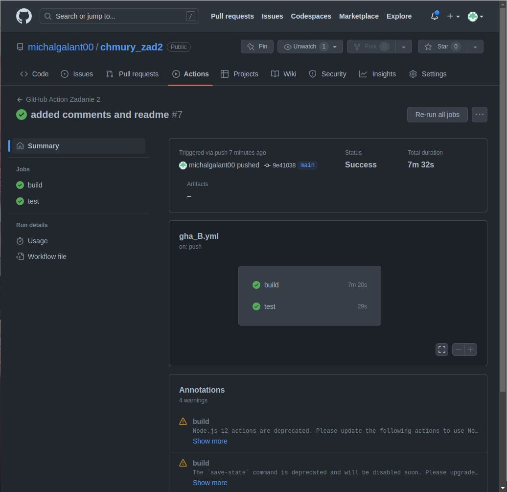
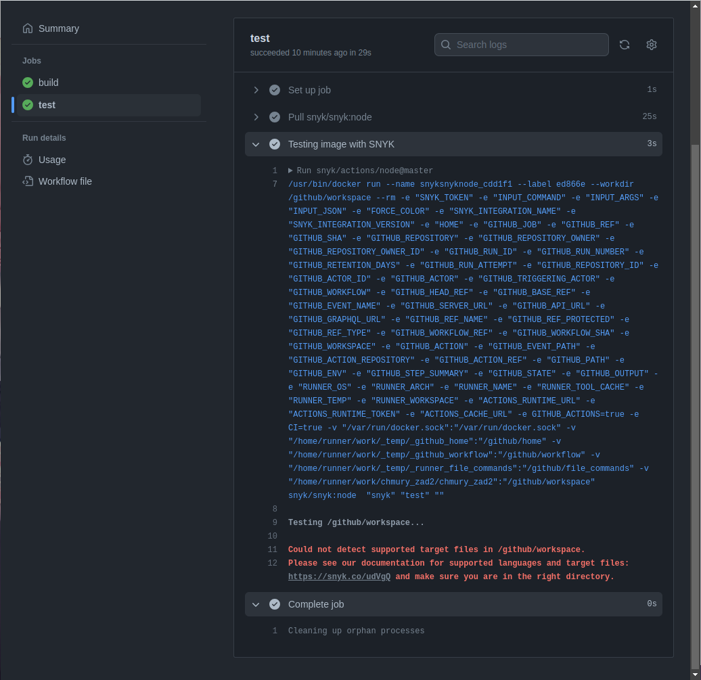

# chmury_zad2

Rozwiązanie zadania 2 z technologii chmurowych.

Michał Galant

## 1. Działanie projektu

### 1. Aplikacja


### 2. Łańcuch GitHub Actions



### 3. Testowanie pod kątem CVE



## 2. Struktura plików

### 1. App.js

```js
import logo from "./logo.svg";
import "./App.css";

function App() {
  return (
    <div className="App">
      <header className="App-header">
        
        <p>Michał Galant</p>
      </header>
    </div>
  );
}

export default App;
```

### 2. Dockerfile

```dockerfile
# na bazie obrazu node:alpine
FROM node:alpine as builder
# wprowadzenie zmiennej środowiskowej do obrazu
ENV NODE_OPTIONS=--openssl-legacy-provider
# ustawienie katalogu roboczego
WORKDIR '/app'
# sekcja z kopiowaniem i budowaniem projektu z zależnościami
COPY package.json .
RUN npm install
COPY . .
RUN npm run build

# na bazie obrazu nginx wystawienie zbudowanej aplikacji
FROM nginx
EXPOSE 80
COPY --from=builder /app/build /usr/share/nginx/html
```

### 3. Łańcuch GitHub Actions - plik gha_B.yml

```yml
name: GitHub Action Zadanie 2

on:
  # umożliwia ręczne uruchomienie zadania
  workflow_dispatch:
  # zadanie wykona się po wykonaniu push na gałęzi main
  push:
    branches: [main]

jobs:
  # zadanie build
  build:
    # zostanie uruchomione na najnowszym ubuntu
    runs-on: ubuntu-latest

    # określenie kolejnych kroków budowy
    steps:
      # repozytorium zostanie sklonowane na maszynie wirtualnej
      - name: Checkout
        uses: actions/checkout@v3

      # konfiguracja buildx
      - name: Buildx set-up
        uses: docker/setup-buildx-action@v2
        with:
          driver-opts: image=moby/buildkit:v0.11.0
          buildkitd-flags: --debug

      # konfiguracja QEMU - emulacja różnych architektur
      - name: Docker Setup QEMU
        uses: docker/setup-qemu-action@v2

      # zapisywanie obrazów docker do cache
      - name: Cache Docker layers
        uses: actions/cache@v3
        with:
          path: /tmp/.buildx-cache
          key: ${{ runner.os }}-buildx-${{ github.sha }}
          restore-keys: |
            ${{ runner.os }}-buildx-

      # logowanie do GHCR
      - name: Login to GHCR
        uses: docker/login-action@v1
        with:
          registry: ghcr.io
          username: ${{ github.repository_owner }}
          password: ${{ secrets.GHCR_TOKEN}}

      # zbudowanie obrazu i wypchnięcie go do repozytorium GHCR
      - name: Build and push
        uses: docker/build-push-action@v4
        with:
          platforms: linux/arm64/v8,x86_64
          context: .
          file: ./Dockerfile
          push: true
          tags: |
            ghcr.io/${{ github.repository_owner }}/chmury_zad2:v1
          cache-from: type=registry,ref=ghcr.io/${{ github.repository_owner }}/chmury_zad2:v1
          cache-to: type=inline

  test:
    runs-on: ubuntu-latest

    steps:
      # testowanie budowanego obrazu pod kątem CVE
      - name: Testing image with SNYK
        uses: snyk/actions/node@master
        id: snyk
        continue-on-error: true
        env:
          SNYK_TOKEN: ${{ secrets.SNYK_TOKEN }}
```
